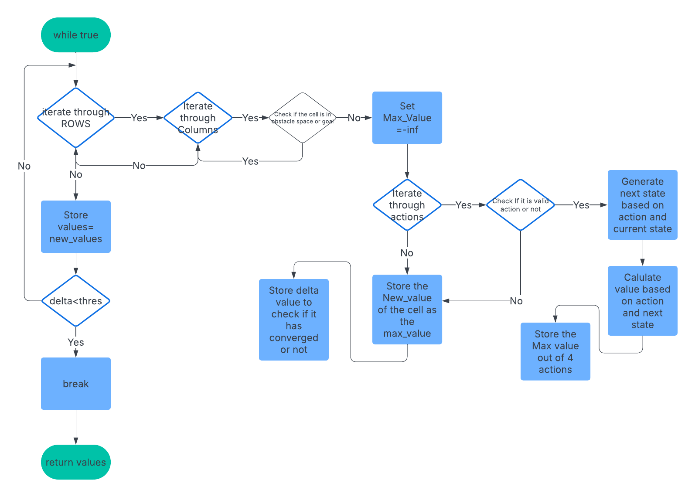

# Solving MDP using Value Iteration

A Markov decision process (MDP) refers to a stochastic decision-making process that uses a mathematical framework to model the decision-making of a dynamic system. It is used in scenarios where the results are either random or controlled by a decision maker, which makes sequential decisions over time. MDPs evaluate which actions the decision maker should take STRICTLY considering the current state and environment of the system.

MDPs are independent of the HISTORY of the states it has previously visited to reach at the current state and the decision for next action is independent of it.

## Flow Chart
Here is the flow chart of the implementation of the value iteration that is used in my python notebook.

### Whats Next?
- Will be adding a GUI based feature to add grid size accordingly
- Will also be making GUI to make obstacle space as well
- Will try to incorporate a stepwise value iteration value incerementing 
- A path will be generated on the GUI when values of the value iteration converges
